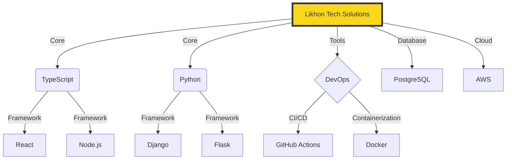

<h1 align="center">
   
  Likhon Solutions 
  
</h1>

  

  

## 🌟 Tech Cosmos

## 🚀 Skill Supernova

| 💻 Language | 🌟 Proficiency |
|-------------|----------------|
| TypeScript  | ███████████░░ 92% |
| Python      | ██████████░░░ 85% |
| JavaScript  | ████████████░ 95% |
| SQL         | ████████░░░░░ 70% |
| Rust        | ███████░░░░░░ 60% |

## 📊 Code Contribution Heatmap

## 🏆 GitHub Trophies

## 🌐 Web Technologies Expertise

   
  

## 🛠 DevOps & Tools

  

## 📱 Let's Connect

  
  
  
  

<h2 align="center">📈 Contribution Graph</h2>

<h2 align="center">💻 Workspace Setup</h2>

  
  
  
  

---

  

